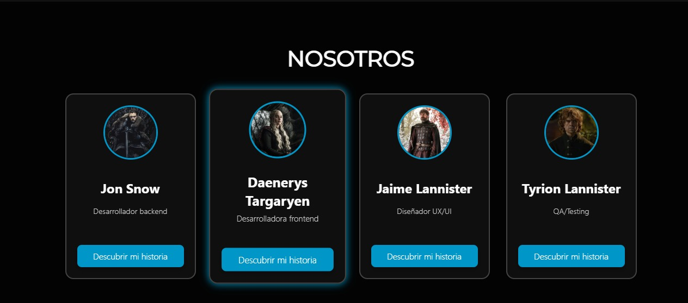

# # TP3 - Trabajo Práctico Grupal 3: Proyecto React en Equipo

**Carrera:** Tecnicatura en Desarrollo de Software / Desarrollo Web Front-End  
**Materia:** Desarrollo de Sistemas Web (Frontend)  
**Grupo:** 15  
**Lanzamiento:** 20/10/2025  
**Entrega:** 10/11/2025  

---
## Links de Entrega
- **Repositorio del proyecto:** 
-  **Web publicada en Vercel:** 
---
## Evolución del Proyecto SPA
Este proyecto forma parte de la **evolución del sitio SPA (Single Page Application)** iniciado en los trabajos prácticos anteriores (TP1 y TP2).  En esta etapa, se implementaron mejoras visuales e interactivas para optimizar la experiencia del usuario, aplicando los conceptos aprendidos. El objetivo general fue **aplicar cinco mejoras sugeridas** demostrando dominio de componentes, estilos, efectos visuales, y adaptación responsive.

---

## Mejora N.º 3: Paginación para la API Externa

### Descripción de la mejora

Se desarrolló e integró un componente denominado `PaginationApi`, encargado de **mostrar y paginar dinámicamente información proveniente de una API pública externa**.
El objetivo fue incorporar un mecanismo de carga progresiva de datos que permita al usuario navegar entre distintas páginas de resultados, optimizando la experiencia y el rendimiento visual de la aplicación.

Los controles de navegación (“Anterior” y “Siguiente”) permiten recorrer los resultados y actualizan la vista en tiempo real.

Los botones de paginación se ubican tanto en la parte **superior como inferior** del listado, mejorando la usabilidad en pantallas grandes.

**Características principales:**

* Carga dinámica de datos desde una API externa mediante `fetch`.
* Paginación implementada en React con control total del estado (`page`, `limit`, `totalPages`).
* Interfaz visual con botones de navegación y contador de página actual.
* Diseño **responsivo** y coherente con el estilo general del sitio.

### Capturas de pantalla

#### Antes de la mejora

#### 🔹 Después de la mejora

### Ubicación y archivos modificados

* Componente principal: `src/components/Characters.jsx`
* Estilos visuales: `src/styles/styles.css` y `src/styles/animations.css`.

---

## Mejora N.º 1: Mejora de la Interfaz: Animaciones Suaves

### Descripción de la mejora

Se agregaron animaciones suaves para que cada parte de la página tenga un movimiento o efecto al mostrarse, para que los cambios de secciones y las cards no aparezcan de golpe, sin transiciones.

Se mejoraron los hover de las tarjetas. Se cambió el color de hover del borde, de un gris al color principal que usamos en los botones y demás. Es un detalle que le da más personalidad a la web y hace que todo combine mejor.

Ejemplo de esta última mejora:

#### Antes de la mejora

#### 🔹 Después de la mejora

## Mejora N.º 5: Barras de Progreso de Habilidades

### Descripción de la mejora

Se implementó un componente reutilizable denominado `ProgressBar`, diseñado para representar visualmente el nivel de dominio que cada miembro posee en distintas habilidades técnicas..

El componente se integra dentro de la vista `MemberDetail`, donde las barras se generan de manera **dinámica** según los datos definidos en el objeto `member`, el cual ahora incluye un nuevo atributo `skillsLevel` que indica el porcentaje de dominio por cada tecnología o lenguaje.

Cada barra se anima suavemente desde cero hasta su valor correspondiente, aportando **fluidez visual y atractivo estético** al sitio.
Se utilizaron **transiciones CSS puras** y se centralizaron los estilos en el archivo `animations.css` para mantener coherencia con la arquitectura del proyecto.

**Características principales:**

* Las habilidades se cargan dinámicamente desde el objeto `member`, junto con su nivel (`skillsLevel`).
* Cada barra presenta una animación de llenado progresivo al renderizarse, utilizando transiciones suaves.
* Las barras son **rectangulares** y se encuentran **alineadas horizontalmente** junto al nombre y porcentaje, logrando un diseño limpio y profesional.
* El componente es **reutilizable**: puede aplicarse en otras secciones del proyecto con diferentes valores de porcentaje o etiquetas.

### 🎨 Capturas de pantalla

#### Antes de la mejora

#### 🔹 Después de la mejora

### Ubicación y archivos modificados

* Componente principal: `src/components/ProgressBar.jsx`
* Estilos y animaciones: `src/styles/animations.css`
* Integración en: `src/pages/MemberDetail.jsx` (sección de habilidades)

---
## Mejora N.º 6: Botones de Redes Sociales Animados
###  Descripción de la mejora
Se implementó un componente personalizado llamado `SocialButtons` que incluye íconos de redes sociales (LinkedIn y GitHub) con efectos visuales al pasar el cursor (`hover`). Esta mejora aporta dinamismo y profesionalismo a la interfaz, alineándose con la estética del sitio y fomentando la interacción del usuario.
- Los íconos escalan suavemente y cambian de color al pasar el mouse.
- Se utilizaron enlaces ficticios (`#`) como placeholders, tal como lo solicita el TP.
- El diseño es responsivo y se adapta correctamente a distintos tamaños de pantalla.
- Se empleó la librería `react-icons` para los íconos y estilos en CSS puro para las animaciones.
### Capturas de pantalla
#### Antes de la mejora
_No se incluían botones de redes sociales ni elementos interactivos relacionados._
.jpg)
#### 🔹 Después de la mejora
_Se agregaron los botones con animaciones y estilo personalizado._
.jpg)
### Ubicación del componente: Carpeta: `src/components/SocialButtons.jsx`
Dependencias utilizadas: npm install react-icons

---

